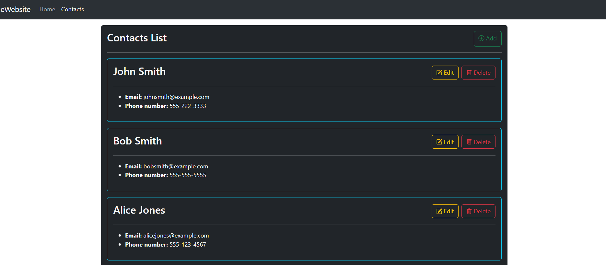

# Routing avec Paramètres
### Objectif 
Appréhender l'utilisation des paramètres de route dans le cadre d'une application React usant de React-Router-DOM

### Sujet
Réaliser une application React permettant à un utilisateur de manipuler des contacts. L'application se servira des paramètres de route pour proposer via un seul composant les différentes manipulation de CRUD de contacts. Les contacts disposeront d'un **nom**, d'un **prénom**, d'un **email**, d'un **numéro de téléphone** et d'un **id** pour les différencier. 

L'**ajout**, l'**édition** et la **suppression** passeront par l'utilisation d'un formulaire commun dont le mode sera fixé via les paramètres de recherche dans la route de l'élément. L'id du contact sera envoyé au mode d'édition et / ou de suppression via la route en elle-même. 

Vous obtiendrez alors une route de ce genre: 
`/contacts/edit/<contactId>?mode=<mode du formulaire>`

--- 

